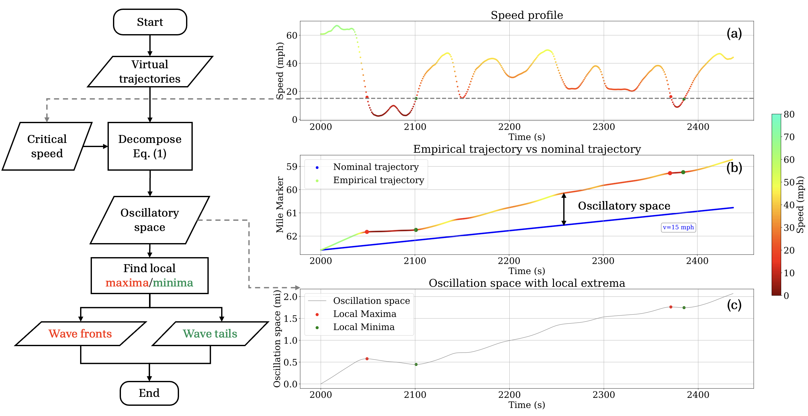

# wave-analysis
Wave analysis tool for I-24 MOTION data

This repository contains the wave analysis tool given the speed field generated from I-24 MOTION INCEPTION data v1.0.

File structure:
- `data/`: Folder containing the input data files (speed fields) and output results.
- `demo/`: Folder containing demo scripts to illustrate the usage of the wave analysis tool.

## Flow chart for wave identification

