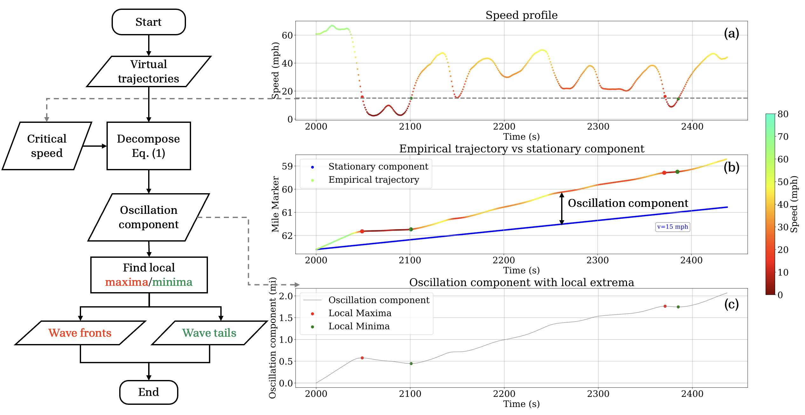

# wave-analysis
A tool for analyzing stop-and-go waves in I-24 MOTION INCEPTION v1.0 data.

## Repository Structure

- `data/`: Input data.
- `demo/`: Example scripts demonstrating tool usage.
- `results/`: Output results.

## Wave Identification Flowchart



## Citation

If you use this code, please consider citing the following paper:

```
@article{ji2024scalable,  
    title={Scalable analysis of stop-and-go waves},  
    author={Ji, Junyi and Gloudemans, Derek and Wang, Yanbing and Zach{\'a}r, Gergely and Barbour, William and Sprinkle, Jonathan and Piccoli, Benedetto and Work, Daniel B},  
    journal={arXiv preprint arXiv:2409.00326},  
    year={2024}  
}
```